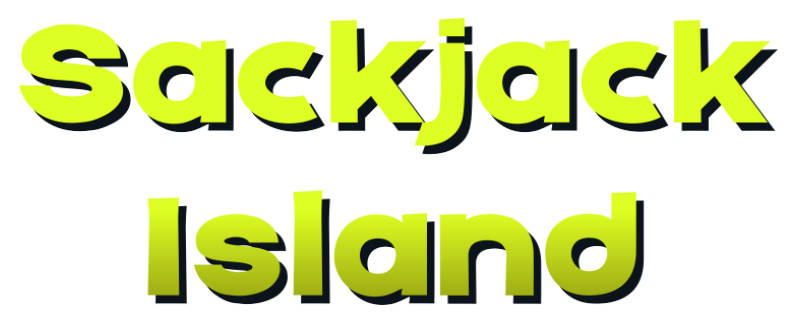

### .github/workflows/deploy.yml

```yaml
name: Deploy to GitHub Pages

on:
  # Runs on pushes targeting the default branch
  push:
    branches: ["main"]

  # Allows you to run this workflow manually from the Actions tab
  workflow_dispatch:

# Sets permissions of the GITHUB_TOKEN to allow deployment to GitHub Pages
permissions:
  contents: read
  pages: write
  id-token: write

# Allow only one concurrent deployment, skipping runs queued between the run in-progress and latest queued.
# However, do NOT cancel in-progress runs as we want to allow these production deployments to complete.
concurrency:
  group: "pages"
  cancel-in-progress: false

jobs:
  # Build job
  build:
    runs-on: ubuntu-latest
    steps:
      - name: Checkout
        uses: actions/checkout@v4
      
      - name: Setup Pages
        uses: actions/configure-pages@v4
      
      - name: Upload artifact
        uses: actions/upload-pages-artifact@v3
        with:
          # Upload entire repository
          path: '.'

  # Deployment job
  deploy:
    environment:
      name: github-pages
      url: ${{ steps.deployment.outputs.page_url }}
    runs-on: ubuntu-latest
    needs: build
    steps:
      - name: Deploy to GitHub Pages
        id: deployment
        uses: actions/deploy-pages@v4
```

---

### README.md

```md
# Ninja Pirate Robot Alien Games

Welcome to the official website repository for **Ninja Pirate Robot Alien** - a game development studio creating vibrant, explosive games with modular design and comic-book aesthetics.

## 🎮 About

N.P.R.A. Games is dedicated to creating games with explosive energy and modular design. We believe in transparent development, sharing our process through devlogs and interactive demos.

### Current Projects

- **Sackjack Island** - A vibrant adventure game featuring dynamic gameplay and blackjack and potatoes...

## 🚀 Site Features

- Modern, responsive design with vibrant gradients and bold typography
- Comic-book inspired aesthetic
- Interactive project showcases and demos
- Development blog (devlogs)
- Studio information and contact pages

## 🛠️ Technology Stack

- **HTML5** - Semantic markup with modular partials
- **CSS3** - Custom styles with CSS variables and gradients
- **Vanilla JavaScript** - Dynamic content loading and interactivity
  
## 📂 Site Project Structure

```
.
├── index.html              # Main landing page
├── style.css              # Global styles with comic-book aesthetic
├── script.js              # Main JavaScript functionality
├── partials/              # Reusable HTML components (header, footer)
├── assets/                # Static assets (images, logos, UI elements)
├── sackjack-island/       # Sackjack Island project pages
├── devlogs/               # Development blog posts
└── studio/                # Studio information pages
```

**Live Site:** https://cbtechny.github.io/ninjapiraterobotalien_com/

## 📝 License

Copyright © 2024 NinjaPirate Studio. All rights reserved.

## 🤝 Contact

- **Website:** [ninjapiraterobotalien.com](https://ninjapiraterobotalien.com)
- **Studio Pages:** [About](studio/about.html) | [Contact](studio/contact.html)

---

Made with 💥 by NinjaPirate Studio
```

---

### assets/README.md

```md
# NinjaPirate Studio Assets

This directory contains all static assets for the NinjaPirate Studio website.

## Structure

- **images/** - Screenshots, concept art, thumbnails, and general imagery
- **logos/** - Studio logo variations and branding assets
- **ui/** - UI elements, icons, and interface components
- **css/** - Additional stylesheets (if needed beyond main style.css)
- **js/** - Additional JavaScript modules (if needed beyond main script.js)

## Image Guidelines

### Thumbnails
- Use 16:9 aspect ratio for project cards
- Recommended size: 800x450px
- Optimize for web (keep under 200KB)

### Screenshots
- Full resolution: 1920x1080px or higher
- Gallery images: 1200x675px
- Always include alt text

### Logos
- Provide SVG when possible for scalability
- Include PNG fallbacks at multiple sizes (256px, 512px, 1024px)
- Transparent backgrounds for overlay use

## Naming Convention

Use descriptive, lowercase names with hyphens:
- `sackjack-island-thumbnail.png`
- `beach-landing-screenshot-01.png`
- `studio-logo-full-color.svg`

## Asset Placeholder

Currently, assets are using CSS-based placeholders with emoji/gradient backgrounds. 
Replace these with actual assets as they become available during development.

## Performance Notes

- Compress all images before uploading
- Use modern formats (WebP with PNG fallback)
- Implement lazy loading for gallery images
- Consider using a CDN for production deployment
```

---

### devlogs/index.html

```html
<!DOCTYPE html>
<html lang="en">
<head>
  <meta charset="UTF-8">
  <meta name="viewport" content="width=device-width, initial-scale=1.0">
  <title>Devlogs - Ninja Pirate Robot Alien</title>
  <meta name="description" content="Development logs and updates from Ninja Pirate Robot Alien. Follow our journey building games with explosive energy and bold vision.">
  <link rel="stylesheet" href="../style.css">
  <link rel="icon" href="../favicon.ico">

  <link rel="preconnect" href="https://fonts.googleapis.com">
  <link rel="preconnect" href="https://fonts.gstatic.com" crossorigin>
  <link href="https://fonts.googleapis.com/css2?family=Bangers&family=Inter:wght@400;600;700&display=swap" rel="stylesheet">
</head>

<body>
  <!-- Header Placeholder - Injected via JS -->
  <div id="header-placeholder"></div>

  <!-- Page Header -->
  <section class="hero hero-compact">
    <div class="hero-content">
      <h1>Devlogs</h1>
      <p class="hero-tagline">Behind the scenes of game development</p>
    </div>
  </section>

  <!-- Devlog Posts Section -->
  <section class="section">
    <div class="container">
      <div class="card-grid">

        <!-- Devlog Post 002 -->
        <article class="card">
          <div class="card-image">📝</div>
          <h3 class="card-title">Building the Island</h3>
          <p class="article-meta">January 10, 2026 • Devlog #002</p>
          <p class="card-description">
            Diving into world-building for Sackjack Island. Exploring modular level design,
            environmental storytelling, and creating a cohesive visual identity.
          </p>
          <a class="card-link" href="posts/002.html">Read Post</a>
        </article>

        <!-- Devlog Post 001 -->
        <article class="card">
          <div class="card-image">🎮</div>
          <h3 class="card-title">Project Kickoff</h3>
          <p class="article-meta">January 1, 2026 • Devlog #001</p>
          <p class="card-description">
            Welcome to Ninja Pirate Robot Alien! First devlog covering our goals, development philosophy,
            and introducing Sackjack Island—our flagship project.
          </p>
          <a class="card-link" href="posts/001.html">Read Post</a>
        </article>

        <!-- Placeholder for Future Posts -->
        <article class="card opacity-60">
          <div class="card-image">⏳</div>
          <h3 class="card-title">More Coming Soon</h3>
          <p class="article-meta">Coming Soon • Devlog #003</p>
          <p class="card-description">
            Stay tuned for more development updates, technical deep dives, and insights
            into our creative process.
          </p>
        </article>

      </div>
    </div>
  </section>

  <!-- Footer Placeholder - Injected via JS -->
  <div id="footer-placeholder"></div>

  <script src="../script.js"></script>
</body>
</html>
```

---

### devlogs/posts/001.html

```html
<!DOCTYPE html>
<html lang="en">
<head>
  <meta charset="UTF-8">
  <meta name="viewport" content="width=device-width, initial-scale=1.0">
  <title>Project Kickoff - Devlog #001 - Ninja Pirate Robot Alien</title>
  <meta name="description" content="First devlog from Ninja Pirate Robot Alien covering our goals, development philosophy, and introducing Sackjack Island.">
  <link rel="stylesheet" href="../../style.css">
  <link rel="icon" href="../../favicon.ico">

  <link rel="preconnect" href="https://fonts.googleapis.com">
  <link rel="preconnect" href="https://fonts.gstatic.com" crossorigin>
  <link href="https://fonts.googleapis.com/css2?family=Bangers&family=Inter:wght@400;600;700&display=swap" rel="stylesheet">
</head>

<body>
  <!-- Header Placeholder - Injected via JS -->
  <div id="header-placeholder"></div>

  <!-- Article Content -->
  <article class="article-content">
    <a href="../index.html" class="back-link">Back to Devlogs</a>

    <header class="article-header">
      <h1>Project Kickoff</h1>
      <p class="article-meta">January 1, 2026 • Devlog #001 • 5 min read</p>
    </header>

    <section>
      <h2>Welcome to Ninja Pirate Robot Alien</h2>
      <p>
        Happy New Year! Today marks the official launch of Ninja Pirate Robot Alien and the beginning
        of an exciting journey into indie game development. This first devlog covers our mission,
        development philosophy, and introduces our flagship project: <strong>Sackjack Island</strong>.
      </p>

      <h2>Our Mission</h2>
      <p>
        Ninja Pirate Robot Alien was founded with a simple goal: create games that are as fun to
        develop as they are to play. We believe in transparent development, community engagement,
        and bold creative choices that push boundaries while staying true to our vision.
      </p>
      <p>
        Our games blend vibrant comic-book aesthetics with modern game design principles,
        resulting in experiences that are visually striking, mechanically sound, and
        narratively engaging.
      </p>

      <h2>Our Philosophy</h2>
      <p>
        We embrace bold aesthetics with vibrant colors and explosive visual effects. Our development
        process emphasizes modular design for flexible, expandable systems. We're committed to:
      </p>
      <ul>
        <li><strong>Bold Aesthetics:</strong> Comic-book inspired visuals with explosive effects</li>
        <li><strong>Modular Design:</strong> Flexible, expandable game systems for rapid prototyping</li>
        <li><strong>Transparent Development:</strong> Sharing our process through regular devlogs</li>
        <li><strong>Player-First:</strong> Gameplay feel and player experience are paramount</li>
      </ul>

      <h2>Introducing Sackjack Island</h2>
      <p>
        Sackjack Island is our flagship project—a vibrant blackjack-style tournament game where
        potatoes battle it out on a mysterious island. Face off against quirky opponents, collect
        jokers and special cards, and unlock new fighters as you climb toward first place.
      </p>

      <h3>Core Features</h3>
      <ul>
        <li>Fast-paced blackjack matches with powerups and strategic depth</li>
        <li>Unlockable potato characters with unique abilities</li>
        <li>Comic-book inspired art style with bold, vibrant visuals</li>
        <li>Quick play sessions designed for engaging gameplay</li>
      </ul>

      <h2>Development Process</h2>
      <p>
        We're taking a transparent approach to development using Godot Engine. Our process emphasizes
        rapid prototyping, community feedback, and regular updates. Expect devlogs covering:
      </p>
      <ul>
        <li>Technical deep dives into game systems and mechanics</li>
        <li>Art and design process breakdowns</li>
        <li>Challenges we face and how we solve them</li>
        <li>Playable demos and prototypes</li>
      </ul>

      <h2>What's Next?</h2>
      <p>
        Over the coming weeks, we'll be diving into gameplay mechanics, creating card systems,
        and building our first playable prototype. The next devlog will focus on world-building
        and the modular systems powering Sackjack Island.
      </p>
      <p>
        Thanks for joining us on this journey. Follow along as we build something explosive!
      </p>
    </section>

    <footer style="margin-top: 3rem; padding-top: 2rem; border-top: 2px solid var(--color-surface-light);">
      <a href="../index.html" class="back-link">Back to Devlogs</a>
    </footer>
  </article>

  <!-- Footer Placeholder - Injected via JS -->
  <div id="footer-placeholder"></div>

  <script src="../../script.js"></script>
</body>
</html>
```

---

### devlogs/posts/002.html

```html
<!DOCTYPE html>
<html lang="en">
<head>
  <meta charset="UTF-8">
  <meta name="viewport" content="width=device-width, initial-scale=1.0">
  <title>Building the Island - Devlog #002 - Ninja Pirate Robot Alien</title>
  <meta name="description" content="Exploring world-building, tournament structure, and zone design for Sackjack Island.">
  <link rel="stylesheet" href="../../style.css">
  <link rel="icon" href="../../favicon.ico">

  <link rel="preconnect" href="https://fonts.googleapis.com">
  <link rel="preconnect" href="https://fonts.gstatic.com" crossorigin>
  <link href="https://fonts.googleapis.com/css2?family=Bangers&family=Inter:wght@400;600;700&display=swap" rel="stylesheet">
</head>

<body>
  <!-- Header Placeholder - Injected via JS -->
  <div id="header-placeholder"></div>

  <!-- Article Content -->
  <article class="article-content">
    <a href="../index.html" class="back-link">Back to Devlogs</a>

    <header class="article-header">
      <h1>Building the Island</h1>
      <p class="article-meta">January 10, 2026 • Devlog #002 • 7 min read</p>
    </header>

    <section>
      <h2>World-Building Progress</h2>
      <p>
        This week, we've made significant progress on the world of Sackjack Island. Our focus
        has been on creating a cohesive blackjack tournament environment that combines fast-paced
        card gameplay with the island's quirky potato inhabitants.
      </p>

      <h2>Tournament Structure</h2>
      <p>
        On Sackjack Island, potatoes don't bake… they battle. The island hosts the biggest
        blackjack tournament in the spud world, and players compete against quirky opponents
        to climb toward first place.
      </p>

      <h2>The Island's Zones</h2>
      <p>
        The island is divided into distinct zones, each hosting different tournament stages
        and opponents:
      </p>
      <ul>
        <li><strong>Beach Landing - Tournament Prep Area:</strong> Your entry point to the island with gentle waves and golden sand. Converse with characters, prepare for battles, and get a feel for the island's unique blackjack style.</li>
        <li><strong>Jungle Canopy:</strong> Dense vegetation with vertical exploration and opponents that are more intelligent than they appear.</li>
        <li><strong>Summit Sanctuary:</strong> The island's highest point where all paths lead. Face off against the toughest opponent here.</li>
      </ul>

      <h2>Gameplay Focus</h2>
      <p>
        We're building the game around fast-paced blackjack mechanics with strategic depth:
      </p>
      <ul>
        <li><strong>Quick Matches:</strong> Games are designed to be fast and engaging, perfect for quick sessions</li>
        <li><strong>Special Cards:</strong> Collect jokers and powerups to add strategic variety</li>
        <li><strong>Character Unlocks:</strong> Win to unlock new potato fighters with unique abilities</li>
        <li><strong>Tournament Progression:</strong> Climb through zones to reach the final showdown</li>
      </ul>

      <h2>Visual Identity</h2>
      <p>
        The art style embraces vibrant comic-book aesthetics with bold colors and dynamic effects:
      </p>
      <ul>
        <li>Bold, saturated color palettes for visual impact</li>
        <li>Dynamic lighting with explosive highlights</li>
        <li>Stylized character designs with expressive animations</li>
        <li>Particle effects for card actions and victories</li>
      </ul>

      <h2>Technical Approach: Modular Design</h2>
      <p>
        Our modular system in Godot allows for rapid prototyping and flexible content creation.
        This approach enables us to:
      </p>
      <ul>
        <li>Quickly test new card mechanics and opponent behaviors</li>
        <li>Add new characters and abilities without breaking existing systems</li>
        <li>Optimize performance by loading zones dynamically</li>
        <li>Respond to community feedback with iterative updates</li>
      </ul>

      <h2>What's Next?</h2>
      <p>
        Now that the island structure is in place, we're diving into core gameplay mechanics.
        The next devlog will cover:
      </p>
      <ul>
        <li>Blackjack mechanics and card system implementation</li>
        <li>Character abilities and strategic gameplay</li>
        <li>Early gameplay footage from our first playable prototype</li>
      </ul>
      <p>
        Thanks for following along! We're excited to share more as Sackjack Island comes to life.
      </p>
    </section>

    <footer style="margin-top: 3rem; padding-top: 2rem; border-top: 2px solid var(--color-surface-light);">
      <a href="../index.html" class="back-link">Back to Devlogs</a>
    </footer>
  </article>

  <!-- Footer Placeholder - Injected via JS -->
  <div id="footer-placeholder"></div>

  <script src="../../script.js"></script>
</body>
</html>
```

---

### index.html

```html
<!DOCTYPE html>
<html lang="en">
<head>
  <meta charset="UTF-8">
  <meta name="viewport" content="width=device-width, initial-scale=1.0">
  <title>Ninja Pirate Robot Alien Games - Fun games, good vibes for everyone!</title>
  <meta name="description" content="Ninja Pirate Robot Alien creates vibrant, explosive games with modular design. Explore our current projects including Sackjack Island and interactive demos.">
  <link rel="stylesheet" href="style.css">
  <link rel="icon" href="favicon.ico">

  <link rel="preconnect" href="https://fonts.googleapis.com">
  <link rel="preconnect" href="https://fonts.gstatic.com" crossorigin>
  <link href="https://fonts.googleapis.com/css2?family=Bangers&family=Inter:wght@400;600;700&display=swap" rel="stylesheet">
</head>

<body>
  <!-- Header Placeholder - Injected via JS -->
  <div id="header-placeholder"></div>

  <!-- Hero Section -->
  <section class="hero">
    <div class="hero-content">
      <h1>Ninja Pirate Robot Alien</h1>
      <p class="hero-tagline">Small games, big energy, and a whole lot of charming chaos.</p>
      <div class="cta-wrapper">
        
        <a class="cta-button text-white" href="sackjack-island/index.html">Explore Sackjack Island (Under development)</a>
      </div>
    </div>
  </section>

  <!-- Current Projects Section -->
  <section class="section">
    <div class="container">
      <h2 class="section-title">Current Projects</h2>
      <div class="card-grid">

        <!-- Sackjack Island Card -->
        <div class="card">
          <a href="sackjack-island/index.html" class="card-image-link">
            <div class="card-image">
              
            </div>
          </a>
          <h3 class="card-title">Sackjack Island</h3>
          <a href="devlogs/index.html" aria-label="View devlogs">
            <p class="card-description">A blackjack‑battle mashup where potato characters duke it out using cards, luck, and pure delusion!</p>
          </a>
          <a class="card-link" href="sackjack-island/index.html">Learn More</a>
        </div>

        <!-- Future Project Placeholder -->
        <div class="card">
          <div class="card-image">🎮</div>
          <h3 class="card-title">Future Projects</h3>
          <p class="card-description">More explosive games and interactive experiences coming soon. Follow our devlogs to stay updated.</p>
          <a class="card-link" href="devlogs/index.html">View Devlogs</a>
        </div>

      </div>
    </div>
  </section>

  <!-- About Studio Section -->
  <section class="section section-subtle">
    <div class="container text-center">
      <h2 class="section-title">About Our Studio</h2>
      <p class="about-text">
        I make quirky, modular games fueled by bright colors, silly ideas, and a love for experimenting. If you enjoy devlogs, behind‑the‑scenes breakdowns, and watching games evolve in the open, you’ll feel right at home — and if a game clicks with you, you’re welcome to snag it and join the fun. <br>-Chris @ Ninja Pirate Robot Alien ( <a href="mailto:c@ninjapiraterobotalien.com">c@ninjapiraterobotalien.com</a> )</br>
      </p>
      <a class="cta-button mt-md" href="studio/about.html">Learn More About Us</a>
    </div>
  </section>

  <!-- Footer Placeholder - Injected via JS -->
  <div id="footer-placeholder"></div>

  <script src="script.js"></script>
</body>
</html>
```

---

### partials/footer.html

```html
<footer class="site-footer">
  <div class="container">
    <div class="footer-content">
      <div class="footer-left">
        <p>&copy; 2026 Ninja Pirate Robot Alien Studio. All rights reserved.</p>
      </div>
      <div class="footer-right">
        <nav class="footer-nav">
          <a href="/studio/store.html">Store</a>
          <a href="/studio/about.html">About</a>
          <a href="/studio/contact.html">Contact</a>
          <a href="/devlogs/index.html">Devlogs</a>
        </nav>
      </div>
    </div>
  </div>
</footer>
```

---

### partials/header.html

```html
<header class="site-header">
  <div class="container">
    <div class="header-content">
      <div class="logo">
        <a href="/index.html" class="logo-link">
          <span class="logo-text">N.P.R.A.</span>
          <span class="logo-accent">Games</span>
        </a>
      </div>
      <nav class="main-nav">
        <ul>
          <li><a href="/index.html" class="nav-home">Home</a></li>
          <li><a href="/sackjack-island/index.html">Sackjack Island</a></li>
          <li><a href="/devlogs/index.html">Devlogs</a></li>
          <li><a href="/studio/store.html">Store</a></li>
          <li><a href="/studio/about.html">About</a></li>
          <li><a href="/studio/contact.html">Contact</a></li>
        </ul>
      </nav>
      <button class="mobile-menu-toggle" aria-label="Toggle menu">
        <span></span>
        <span></span>
        <span></span>
      </button>
    </div>
  </div>
</header>
```

---

### sackjack-island/about.html

```html
<!DOCTYPE html>
<html lang="en">
<head>
  <meta charset="UTF-8">
  <meta name="viewport" content="width=device-width, initial-scale=1.0">
  <title>About Sackjack Island - NinjaPirate Studio</title>
  <meta name="description" content="Learn about Sackjack Island, its gameplay mechanics, story, and development journey.">
  <link rel="stylesheet" href="../style.css">
  <link rel="icon" href="../favicon.ico">

  <link rel="preconnect" href="https://fonts.googleapis.com">
  <link rel="preconnect" href="https://fonts.gstatic.com" crossorigin>
  <link href="https://fonts.googleapis.com/css2?family=Bangers&family=Inter:wght@400;600;700&display=swap" rel="stylesheet">
</head>

<body>
  <!-- Header Placeholder - Injected via JS -->
  <div id="header-placeholder"></div>

  <!-- Page Header -->
  <section class="hero" style="padding: 4rem 2rem; background: linear-gradient(135deg, #00ccff, #ff0066);">
    <div class="hero-content">
      <h1>About Sackjack Island</h1>
      <p class="hero-tagline">Discover the world, gameplay, and story</p>
    </div>
  </section>

  <!-- Main Content -->
  <article class="article-content">
    <section class="section">
      <h2>The Story</h2>
      <p>
        On Sackjack Island, potatoes don’t bake… they battle. The island hosts the biggest blackjack tournament in the spud world, and you’ve been invited to compete.
      </p>

      <p>
        Face off against quirky opponents, collect jokers and special cards, and unlock new fighters as you climb toward first place. Quick games, big laughs, and plenty of potatoes.
      </p>

    </section>

    <section class="section">
      <h2>Gameplay Features</h2>
      <div class="card-grid">
        <div class="card">
          <h3 class="card-title">🗺️ Blackjack-style rules!</h3>
          <p class="card-description">
            Players compete in fast-paced blackjack matches using a deck of cards and powerups. Win rounds to earn points and advance in the tournament.
          </p>
        </div>
        <div class="card">
          <h3 class="card-title">🧩 Unlockable Characters</h3>
          <p class="card-description">
            Win and unlock a variety of potato characters, each with unique abilities and playstyles to suit different strategies.
          </p>
        </div>
        <div class="card">
          <h3 class="card-title">⚡ Quick Play</h3>
          <p class="card-description">
            Just jump in and play! Matches are designed to be fast and engaging, perfect for quick gaming sessions.
          </p>
        </div>
        <div class="card">
          <h3 class="card-title">🎨 Comic Aesthetics</h3>
          <p class="card-description">
            Vibrant, stylized visuals inspired by comic books. Bold colors, dynamic
            effects, and expressive character designs.
          </p>
        </div>
      </div>
    </section>

    <section class="section">
      <h2>The Island's Zones</h2>
      <ul style="list-style: none; padding: 0;">
        <li style="margin-bottom: 1.5rem;">
          <h3 style="color: var(--color-accent); margin-bottom: 0.5rem;">🏖️ Beach Landing</h3>
          <h4> Tournament Prep Area</h4>
          <p>Your entry point to the island. Gentle waves, golden sand, and the first hints of mysteries ahead.</p>
          <p>Converse with characters, prepare for battles, and get a feel for the island's unique blackjack style.</p>
        </li>
        <li style="margin-bottom: 1.5rem;">
          <h3 style="color: var(--color-accent); margin-bottom: 0.5rem;">🌴 Jungle Canopy</h3>
          <p>Dense vegetation, vertical exploration, and wildlife that's more intelligent than it appears.</p>
        </li>
        <li style="margin-bottom: 1.5rem;">
          <h3 style="color: var(--color-accent); margin-bottom: 0.5rem;">⛰️ Summit Sanctuary</h3>
          <p>The island's highest point. All paths lead here, and all questions find their answers. Face off against the toughest opponent here.</p>
        </li>
      </ul>
    </section>

    <section class="section">
      <h2>Development Journey</h2>
      <p>
        Sackjack Island is being developed using Godot Engine, with a focus on modular
        design that allows for rapid prototyping and flexible content creation. Follow
        our development through regular devlogs covering technical challenges, design
        decisions, and creative breakthroughs.
      </p>
      <p>
        We're committed to transparent development and community engagement. Your feedback
        helps shape the game as we build it.
      </p>
      <div style="margin-top: 2rem; text-align: center;">
        <a href="../devlogs/index.html" class="cta-button">Read Development Logs</a>
      </div>
    </section>

    <section class="section text-center">
      <h2>Experience the Island</h2>
      <div style="display: flex; gap: 1rem; justify-content: center; flex-wrap: wrap; margin-top: 2rem;">
        <a href="gallery.html" class="cta-button">View Gallery</a>
        <a href="demo.html" class="cta-button">Play Demo</a>
      </div>
    </section>
  </article>

  <!-- Footer Placeholder - Injected via JS -->
  <div id="footer-placeholder"></div>

  <script src="../script.js"></script>
</body>
</html>
```

---

### sackjack-island/demo.html

```html
<!DOCTYPE html>
<html lang="en">
<head>
  <meta charset="UTF-8">
  <meta name="viewport" content="width=device-width, initial-scale=1.0">
  <title>Play Demo - Sackjack Island - NinjaPirate Studio</title>
  <meta name="description" content="Play Sackjack Island demo directly in your browser. Experience the vibrant world and gameplay.">
  <link rel="stylesheet" href="../style.css">
  <link rel="icon" href="../favicon.ico">

  <link rel="preconnect" href="https://fonts.googleapis.com">
  <link rel="preconnect" href="https://fonts.gstatic.com" crossorigin>
  <link href="https://fonts.googleapis.com/css2?family=Bangers&family=Inter:wght@400;600;700&display=swap" rel="stylesheet">
</head>

<body>
  <!-- Header Placeholder - Injected via JS -->
  <div id="header-placeholder"></div>

  <!-- Page Header -->
  <section class="hero" style="padding: 4rem 2rem; background: linear-gradient(135deg, #0066ff, #ff0066);">
    <div class="hero-content">
      <h1>Play Sackjack Island</h1>
      <p class="hero-tagline">Experience the demo in your browser</p>
    </div>
  </section>

  <!-- Demo Section -->
  <section class="section">
    <div class="container">
      <h2 class="section-title">Interactive Demo</h2>

      <!-- Demo Container -->
      <div class="demo-container">
        <div class="demo-placeholder">
          <h3>🎮 Demo Coming Soon</h3>
          <p style="max-width: 600px; text-align: center;">
            We're working on a playable browser demo powered by Godot Engine.
            The demo will showcase core gameplay mechanics, exploration, and the
            island's vibrant aesthetic.
          </p>
          <p style="margin-top: 2rem;">
            <a href="../devlogs/index.html" class="cta-button">Follow Development Progress</a>
          </p>
        </div>
      </div>

      <!-- Instructions Section -->
      <div style="max-width: 800px; margin: 3rem auto 0;">
        <h3 style="text-align: center; color: var(--color-accent); margin-bottom: 2rem;">
          What to Expect in the Demo
        </h3>
        <div class="card-grid" style="grid-template-columns: repeat(auto-fit, minmax(250px, 1fr));">
          <div class="card" style="text-align: center;">
            <div style="font-size: 2.5rem; margin-bottom: 1rem;">🏃</div>
            <h4 style="color: var(--color-accent); margin-bottom: 0.5rem;">Core Movement</h4>
            <p style="color: var(--color-text-muted); font-size: 0.95rem;">
              Run, jump, and explore the Beach Landing zone
            </p>
          </div>
          <div class="card" style="text-align: center;">
            <div style="font-size: 2.5rem; margin-bottom: 1rem;">🧩</div>
            <h4 style="color: var(--color-accent); margin-bottom: 0.5rem;">Basic Puzzles</h4>
            <p style="color: var(--color-text-muted); font-size: 0.95rem;">
              Solve environmental puzzles and unlock new areas
            </p>
          </div>
          <div class="card" style="text-align: center;">
            <div style="font-size: 2.5rem; margin-bottom: 1rem;">🎨</div>
            <h4 style="color: var(--color-accent); margin-bottom: 0.5rem;">Visual Style</h4>
            <p style="color: var(--color-text-muted); font-size: 0.95rem;">
              Experience the comic-book inspired aesthetic
            </p>
          </div>
        </div>
      </div>

      <!-- Technical Requirements -->
      <div style="max-width: 700px; margin: 3rem auto; padding: 2rem; background: var(--color-surface); border-radius: var(--radius-md); border-left: 4px solid var(--color-accent);">
        <h4 style="color: var(--color-accent); margin-bottom: 1rem;">🖥️ Technical Requirements (When Available)</h4>
        <ul style="color: var(--color-text-muted); line-height: 1.8;">
          <li>Modern web browser (Chrome, Firefox, Safari, Edge)</li>
          <li>WebGL 2.0 support</li>
          <li>Keyboard and mouse for controls</li>
          <li>Stable internet connection (initial load only)</li>
          <li>~50MB download for first play</li>
        </ul>
      </div>
    </div>
  </section>

  <!-- Alternative Content -->
  <section class="section" style="background: linear-gradient(180deg, transparent, rgba(255, 0, 102, 0.05));">
    <div class="container text-center">
      <h2 class="section-title">While You Wait</h2>
      <p style="color: var(--color-text-muted); max-width: 600px; margin: 0 auto 2rem;">
        Explore the world of Sackjack Island through our development logs, concept art,
        and behind-the-scenes content.
      </p>
      <div style="display: flex; gap: 1rem; justify-content: center; flex-wrap: wrap;">
        <a href="about.html" class="cta-button">About the Game</a>
        <a href="gallery.html" class="cta-button">View Gallery</a>
        <a href="../devlogs/index.html" class="cta-button">Read Devlogs</a>
      </div>
    </div>
  </section>

  <!-- Navigation -->
  <section class="section text-center">
    <a href="index.html" class="back-link">Back to Sackjack Island</a>
  </section>

  <!-- Footer Placeholder - Injected via JS -->
  <div id="footer-placeholder"></div>

  <script src="../script.js"></script>
</body>
</html>
```

---

### sackjack-island/gallery.html

```html
<!DOCTYPE html>
<html lang="en">
<head>
  <meta charset="UTF-8">
  <meta name="viewport" content="width=device-width, initial-scale=1.0">
  <title>Gallery - Sackjack Island - NinjaPirate Studio</title>
  <meta name="description" content="View screenshots, concept art, and visual development for Sackjack Island.">
  <link rel="stylesheet" href="../style.css">
  <link rel="icon" href="../favicon.ico">

  <link rel="preconnect" href="https://fonts.googleapis.com">
  <link rel="preconnect" href="https://fonts.gstatic.com" crossorigin>
  <link href="https://fonts.googleapis.com/css2?family=Bangers&family=Inter:wght@400;600;700&display=swap" rel="stylesheet">
</head>

<body>
  <!-- Header Placeholder - Injected via JS -->
  <div id="header-placeholder"></div>

  <!-- Page Header -->
  <section class="hero" style="padding: 4rem 2rem; background: linear-gradient(135deg, #ff6b35, #ffcc00);">
    <div class="hero-content">
      <h1>Sackjack Island Gallery</h1>
      <p class="hero-tagline">Explore visuals from the island</p>
    </div>
  </section>

  <!-- Gallery Section -->
  <section class="section">
    <div class="container">
      <h2 class="section-title">Screenshots & Concept Art</h2>
      <p style="text-align: center; color: var(--color-text-muted); margin-bottom: 3rem;">
        Visual development and in-game screenshots showcasing Sackjack Island's vibrant world.
      </p>

      <div class="gallery-grid">
        <!-- Gallery Items with Images -->
        <div class="gallery-item">
          
        </div>
        <div class="gallery-item">
          
        </div>
        <div class="gallery-item">
          <div style="width: 100%; height: 100%; background: linear-gradient(135deg, #ffcc00, #ff6b35); display: flex; align-items: center; justify-content: center; font-size: 3rem;">
            🏛️
          </div>
        </div>
        <div class="gallery-item">
          <div style="width: 100%; height: 100%; background: linear-gradient(135deg, #00ff88, #00ccff); display: flex; align-items: center; justify-content: center; font-size: 3rem;">
            💎
          </div>
        </div>
        <div class="gallery-item">
          <div style="width: 100%; height: 100%; background: linear-gradient(135deg, #ff0066, #ffcc00); display: flex; align-items: center; justify-content: center; font-size: 3rem;">
            ⛰️
          </div>
        </div>
        <div class="gallery-item">
          <div style="width: 100%; height: 100%; background: linear-gradient(135deg, #0066ff, #ff0066); display: flex; align-items: center; justify-content: center; font-size: 3rem;">
            🎨
          </div>
        </div>
        <div class="gallery-item">
          <div style="width: 100%; height: 100%; background: linear-gradient(135deg, #ff6b35, #00ff88); display: flex; align-items: center; justify-content: center; font-size: 3rem;">
            🌊
          </div>
        </div>
        <div class="gallery-item">
          <div style="width: 100%; height: 100%; background: linear-gradient(135deg, #ffcc00, #00ccff); display: flex; align-items: center; justify-content: center; font-size: 3rem;">
            ✨
          </div>
        </div>
      </div>

      <div style="text-align: center; margin-top: 3rem;">
        <p style="color: var(--color-text-muted); margin-bottom: 1rem;">
          More screenshots and concept art coming soon as development progresses.
        </p>
        <a href="../devlogs/index.html" class="card-link" style="font-size: 1.1rem;">Follow Development Updates</a>
      </div>
    </div>
  </section>

  <!-- Concept Art Section -->
  <section class="section" style="background: linear-gradient(180deg, transparent, rgba(255, 0, 102, 0.05));">
    <div class="container">
      <h2 class="section-title">Concept Art & Design</h2>
      <div class="card-grid">
        <div class="card">
          <div class="card-image" style="background: linear-gradient(135deg, #ff0066, #ffcc00); font-size: 4rem;">🎨</div>
          <h3 class="card-title">Character Designs</h3>
          <p class="card-description">
            Meet the island's inhabitants. Bold, expressive designs with comic-book flair.
          </p>
        </div>
        <div class="card">
          <div class="card-image" style="background: linear-gradient(135deg, #00ccff, #ff6b35); font-size: 4rem;">🗺️</div>
          <h3 class="card-title">Environment Concepts</h3>
          <p class="card-description">
            Early sketches and concepts for the island's diverse biomes and landmarks.
          </p>
        </div>
        <div class="card">
          <div class="card-image" style="background: linear-gradient(135deg, #00ff88, #0066ff); font-size: 4rem;">💡</div>
          <h3 class="card-title">Gameplay Mockups</h3>
          <p class="card-description">
            Visual exploration of gameplay mechanics, UI design, and interaction systems.
          </p>
        </div>
      </div>
    </div>
  </section>

  <!-- Navigation -->
  <section class="section text-center">
    <a href="index.html" class="back-link">Back to Sackjack Island</a>
  </section>

  <!-- Footer Placeholder - Injected via JS -->
  <div id="footer-placeholder"></div>

  <script src="../script.js"></script>
  <script>
    // Gallery lightbox functionality using event delegation
    const galleryGrid = document.querySelector('.gallery-grid');
    if (galleryGrid) {
      galleryGrid.addEventListener('click', function(event) {
        // Check if the clicked element is an image inside a gallery-item
        const img = event.target.closest('.gallery-item img');
        if (!img) {
          return;
        }

        const modal = document.createElement('div');
        modal.style.cssText = 'position:fixed;top:0;left:0;width:100%;height:100%;background:rgba(0,0,0,0.95);display:flex;align-items:center;justify-content:center;z-index:1000;cursor:pointer;';
        const fullImg = document.createElement('img');
        fullImg.src = img.src;
        fullImg.style.cssText = 'max-width:90%;max-height:90%;object-fit:contain;border-radius:8px;';
        modal.appendChild(fullImg);
        modal.addEventListener('click', () => modal.remove());
        document.body.appendChild(modal);
      });
    }
  </script>
</body>
</html>
```

---

### sackjack-island/index.html

```html
<!DOCTYPE html>
<html lang="en">
<head>
  <meta charset="UTF-8">
  <meta name="viewport" content="width=device-width, initial-scale=1.0">
  <title>Sackjack Island</title>
  <meta name="description" content="Welcome to Sackjack Island — the only place where potatoes settle their differences with blackjack instead of seasoning. Every spud here thinks they’re the next big champion, and you’re the newest challenger. Play fast rounds, unlock new characters, and work your way to the top of the island’s legendary tournament.">
  <link rel="stylesheet" href="../style.css">
  <link rel="icon" href="../favicon.ico">

  <link rel="preconnect" href="https://fonts.googleapis.com">
  <link rel="preconnect" href="https://fonts.gstatic.com" crossorigin>
  <link href="https://fonts.googleapis.com/css2?family=Bangers&family=Inter:wght@400;600;700&display=swap" rel="stylesheet">
</head>

<body>
  <!-- Header Placeholder - Injected via JS -->
  <div id="header-placeholder"></div>

  <!-- Game Hero Section -->
  <section class="hero bg-gradient-game">
    <div class="hero-content">
      <h1 class="text-white text-shadow-strong">Sackjack Island</h1>
      <h2 class="hero-tagline text-highlight-game">
        Welcome to Sackjack Island — the only place where potatoes settle their differences with blackjack instead of seasoning. Every spud here thinks they’re the next big champion, and you’re the newest challenger. Play fast rounds, unlock new characters, and work your way to the top of the island’s legendary tournament.
      </h2>
    </div>
  </section>

  <!-- Quick Navigation -->
  <section class="section section-padding-sm">
    <div class="container">
      <div class="card-grid card-grid-small">
        <a href="about.html" class="card text-center">
          <div class="card-image card-image-small">📖</div>
          <h3 class="card-title card-title-small">About</h3>
          <p class="card-description">Learn about the game</p>
        </a>
        <a href="gallery.html" class="card text-center">
          <div class="card-image card-image-small">🖼️</div>
          <h3 class="card-title card-title-small">Gallery</h3>
          <p class="card-description">View screenshots & art</p>
        </a>
        <a href="demo.html" class="card text-center">
          <div class="card-image card-image-small">🎮</div>
          <h3 class="card-title card-title-small">Demo</h3>
          <p class="card-description">Play in your browser</p>
        </a>
      </div>
    </div>
  </section>

  <!-- Game Overview -->
  <section class="section">
    <div class="container">
      <h2 class="section-title">About the Game</h2>
      <div class="game-overview-container">
        <p class="game-overview-text">
          Sackjack Island is a card game where potatoes battle it out in fast-paced blackjack tournaments.
        </p>
        <a href="about.html" class="cta-button">Learn More</a>
      </div>
    </div>
  </section>

  <!-- Latest Updates -->
  <section class="section section-subtle">
    <div class="container">
      <h2 class="section-title">Latest Updates</h2>
      <div class="card-grid">
        <article class="card">
          <div class="card-image">📝</div>
          <h3 class="card-title">Building the Island</h3>
          <p class="article-meta">January 10, 2026 • Devlog #002</p>
          <p class="card-description">
            Diving into world-building for Sackjack Island. Exploring modular level design
            and environmental storytelling.
          </p>
          <a class="card-link" href="../devlogs/posts/002.html">Read Devlog</a>
        </article>
      </div>
    </div>
  </section>

  <!-- Footer Placeholder - Injected via JS -->
  <div id="footer-placeholder"></div>

  <script src="../script.js"></script>
</body>
</html>
```

---

### script.js

```javascript
/**
 * NinjaPirate Studio - Main JavaScript
 * Handles shared component injection and site interactions
 */

// Track if mobile menu has been initialized to avoid duplicate listeners
let mobileMenuInitialized = false;

// Inject shared header and footer on page load
document.addEventListener('DOMContentLoaded', async () => {
  await injectComponents();
});

/**
 * Fetch and inject header and footer partials into the page
 */
async function injectComponents() {
  try {
    const headerPlaceholder = document.getElementById('header-placeholder');
    const footerPlaceholder = document.getElementById('footer-placeholder');

    const promises = [];

    // Fetch header
    if (headerPlaceholder) {
      promises.push(
        fetch('/partials/header.html')
          .then(response => {
             if (response.ok) return response.text();
             throw new Error('Failed to load header');
          })
          .then(html => {
            headerPlaceholder.innerHTML = html;
            highlightActiveNav();
          })
          .catch(error => console.error('Header load error:', error))
      );
    }

    // Fetch footer
    if (footerPlaceholder) {
      promises.push(
        fetch('/partials/footer.html')
          .then(response => {
            if (response.ok) return response.text();
            throw new Error('Failed to load footer');
          })
          .then(html => {
            footerPlaceholder.innerHTML = html;
          })
          .catch(error => console.error('Footer load error:', error))
      );
    }

    // Wait for all injections to complete
    await Promise.all(promises);

    // Re-initialize mobile menu after header is injected
    initMobileMenu();
  } catch (error) {
    console.error('Error loading components:', error);
  }
}

/**
 * Highlight active navigation item based on current page
 */
function highlightActiveNav() {
  const currentPath = window.location.pathname;
  const navLinks = document.querySelectorAll('.main-nav a, .footer-nav a');

  navLinks.forEach(link => {
    const href = link.getAttribute('href');
    if (href && (currentPath.includes(href) ||
        (currentPath.endsWith('index.html') && link.classList.contains('nav-home')) ||
        (currentPath === '/' && link.classList.contains('nav-home')))) {
      link.style.color = 'var(--color-accent)';
    }
  });
}

/**
 * Initialize mobile menu toggle functionality
 */
function initMobileMenu() {
  // Prevent duplicate initialization
  if (mobileMenuInitialized) {
    return;
  }

  const toggle = document.querySelector('.mobile-menu-toggle');
  const nav = document.querySelector('.main-nav');

  if (toggle && nav) {
    // Add click event to toggle menu
    toggle.addEventListener('click', (e) => {
      e.preventDefault();
      e.stopPropagation();
      nav.classList.toggle('active');
      toggle.classList.toggle('active');
    });

    // Close menu when clicking on nav items
    const navLinks = nav.querySelectorAll('a');
    navLinks.forEach(link => {
      link.addEventListener('click', () => {
        nav.classList.remove('active');
        toggle.classList.remove('active');
      });
    });

    // Close menu when clicking outside
    document.addEventListener('click', (e) => {
      const isToggleOrNav = toggle.contains(e.target) || nav.contains(e.target);
      if (!isToggleOrNav && nav.classList.contains('active')) {
        nav.classList.remove('active');
        toggle.classList.remove('active');
      }
    });

    // Mark as initialized after all event listeners are successfully added
    mobileMenuInitialized = true;
  }
}
```

---

### studio/about.html

```html
<!DOCTYPE html>
<html lang="en">
<head>
  <meta charset="UTF-8">
  <meta name="viewport" content="width=device-width, initial-scale=1.0">
  <title>Ninja Pirate Robot Alien | NYC Based Game Studio</title>
  <meta name="description" content="Learn about Ninja Pirate Robot Alien, our mission, development philosophy, and the team behind the games.">
  <link rel="stylesheet" href="../style.css">
  <link rel="icon" href="../favicon.ico">

  <link rel="preconnect" href="https://fonts.googleapis.com">
  <link rel="preconnect" href="https://fonts.gstatic.com" crossorigin>
  <link href="https://fonts.googleapis.com/css2?family=Bangers&family=Inter:wght@400;600;700&display=swap" rel="stylesheet">
</head>

<body>
  <!-- Header Placeholder - Injected via JS -->
  <div id="header-placeholder"></div>

  <!-- Page Header -->
  <section class="hero" style="padding: 4rem 2rem;">
    <div class="hero-content">
      <h1>About Ninja Pirate Robot Alien</h1>
      <p class="hero-tagline">Creating games with explosive energy and bold vision</p>
    </div>
  </section>

  <!-- Main Content -->
  <article class="article-content">
    <section class="section">
      <h2>Our Mission</h2>
      <p>
        Ninja Pirate Robot Alien was founded with a simple goal: create games that are as fun to
        develop as they are to play. We believe in transparent development, community engagement,
        and bold creative choices that push boundaries while staying true to our vision.
      </p>
      <p>
        Our games blend vibrant comic-book aesthetics with modern game design principles,
        resulting in experiences that are visually striking, mechanically sound, and
        narratively engaging.
      </p>
    </section>

    <section class="section">
      <h2>Our Philosophy</h2>
      <div class="card-grid">
        <div class="card">
          <h3 class="card-title">🎨 Bold Aesthetics</h3>
          <p class="card-description">
            We embrace vibrant colors, explosive visual effects, and comic-book inspired
            art styles. Our games make a statement.
          </p>
        </div>
        <div class="card">
          <h3 class="card-title">🔧 Modular Design</h3>
          <p class="card-description">
            Flexible, expandable systems that allow for rapid prototyping and creative
            experimentation throughout development.
          </p>
        </div>
        <div class="card">
          <h3 class="card-title">📝 Transparent Development</h3>
          <p class="card-description">
            We share our process, challenges, and victories through regular devlogs.
            Our community is part of the journey.
          </p>
        </div>
        <div class="card">
          <h3 class="card-title">🎮 Player-First</h3>
          <p class="card-description">
            Gameplay feel and player experience are paramount. Every decision is made
            with the player in mind.
          </p>
        </div>
      </div>
    </section>

    <section class="section">
      <h2>Development Process</h2>
      <p>
        Our development process emphasizes iteration, community feedback, and transparent
        communication. We believe that showing our work-in-progress builds trust and results
        in better games.
      </p>
      <ul style="list-style: none; padding: 0;">
        <li style="margin-bottom: 1rem;">
          <strong style="color: var(--color-accent);">✓ Rapid Prototyping:</strong>
          Test ideas quickly, fail fast, iterate constantly
        </li>
        <li style="margin-bottom: 1rem;">
          <strong style="color: var(--color-accent);">✓ Regular Updates:</strong>
          Weekly devlogs covering progress, challenges, and decisions
        </li>
        <li style="margin-bottom: 1rem;">
          <strong style="color: var(--color-accent);">✓ Community Feedback:</strong>
          Player input shapes development direction
        </li>
        <li style="margin-bottom: 1rem;">
          <strong style="color: var(--color-accent);">✓ Open Documentation:</strong>
          Share technical details, design docs, and postmortems
        </li>
      </ul>
    </section>

    <section class="section">
      <h2>Technology Stack</h2>
      <p>
        We build our games using modern, proven tools that prioritize developer experience
        and player performance:
      </p>
      <div class="card-grid">
        <div class="card" style="text-align: center;">
          <div style="font-size: 3rem; margin-bottom: 1rem;">🎮</div>
          <h4 style="color: var(--color-accent); margin-bottom: 0.5rem;">Godot Engine</h4>
          <p style="color: var(--color-text-muted); font-size: 0.95rem;">
            Open-source game engine for 2D/3D development with excellent performance
          </p>
        </div>
        <div class="card" style="text-align: center;">
          <div style="font-size: 3rem; margin-bottom: 1rem;">✏️</div>
          <h4 style="color: var(--color-accent); margin-bottom: 0.5rem;">Inkscape</h4>
          <p style="color: var(--color-text-muted); font-size: 0.95rem;">
            Open-source vector graphics editor for creating scalable game assets
          </p>
        </div>
        <div class="card" style="text-align: center;">
          <div style="font-size: 3rem; margin-bottom: 1rem;">🎨</div>
          <h4 style="color: var(--color-accent); margin-bottom: 0.5rem;">Krita</h4>
          <p style="color: var(--color-text-muted); font-size: 0.95rem;">
            Open-source digital painting and illustration tool for vibrant game art
          </p>
        </div>
        <div class="card" style="text-align: center;">
          <div style="font-size: 3rem; margin-bottom: 1rem;">🐧</div>
          <h4 style="color: var(--color-accent); margin-bottom: 0.5rem;">Linux</h4>
          <p style="color: var(--color-text-muted); font-size: 0.95rem;">
            Open-source operating system providing robust development environment
          </p>
        </div>
        <div class="card" style="text-align: center;">
          <div style="font-size: 3rem; margin-bottom: 1rem;">🌐</div>
          <h4 style="color: var(--color-accent); margin-bottom: 0.5rem;">Web Tech</h4>
          <p style="color: var(--color-text-muted); font-size: 0.95rem;">
            HTML/CSS/JS for our site, WebGL for browser-based game demos
          </p>
        </div>
      </div>
    </section>

    <section class="section">
      <h2>Our Current Focus</h2>
      <p>
        We're currently deep in development on <strong>Sackjack Island</strong>, our flagship
        project. The game represents everything we believe in: bold visuals, modular design,
        engaging gameplay, and transparent development.
      </p>
      <p>
        Follow along with our journey through regular devlogs, playable demos, and behind-the-scenes
        content. We're building this game in the open, and we'd love for you to be part of it.
      </p>
      <div style="text-align: center; margin-top: 2rem;">
        <a href="../sackjack-island/index.html" class="cta-button">Explore Sackjack Island</a>
      </div>
    </section>

    <section class="section text-center">
      <h2>Get In Touch</h2>
      <p style="color: var(--color-text-muted); max-width: 600px; margin: 0 auto 2rem;">
        Have questions? Want to collaborate? Interested in following our development?
        We'd love to hear from you.
      </p>
      <a href="contact.html" class="cta-button">Contact Us</a>
    </section>
  </article>

  <!-- Footer Placeholder - Injected via JS -->
  <div id="footer-placeholder"></div>

  <script src="../script.js"></script>
</body>
</html>
```

---

### studio/contact.html

```html
<!DOCTYPE html>
<html lang="en">
<head>
  <meta charset="UTF-8">
  <meta name="viewport" content="width=device-width, initial-scale=1.0">
  <title>Contact - NinjaPirate Studio</title>
  <meta name="description" content="Get in touch with NinjaPirate Studio. Follow our development, ask questions, or explore collaboration opportunities.">
  <link rel="stylesheet" href="../style.css">
  <link rel="icon" href="../favicon.ico">

  <link rel="preconnect" href="https://fonts.googleapis.com">
  <link rel="preconnect" href="https://fonts.gstatic.com" crossorigin>
  <link href="https://fonts.googleapis.com/css2?family=Bangers&family=Inter:wght@400;600;700&display=swap" rel="stylesheet">
</head>

<body>
  <!-- Header Placeholder - Injected via JS -->
  <div id="header-placeholder"></div>

  <!-- Page Header -->
  <section class="hero" style="padding: 4rem 2rem; background: linear-gradient(135deg, #ff6b35, #ff0066);">
    <div class="hero-content">
      <h1>Get In Touch</h1>
      <p class="hero-tagline">Let's build something explosive together</p>
    </div>
  </section>

  <!-- Main Content -->
  <article class="article-content">
    <section class="section text-center">
      <h2>Contact NinjaPirate Studio</h2>
      <p style="color: var(--color-text-muted); max-width: 700px; margin: 0 auto 3rem;">
        We love hearing from players, fellow developers, and creative collaborators.
        Whether you have questions about our games, feedback on development, or ideas
        for collaboration, we're all ears.
      </p>
    </section>

    <section class="section">
      <div class="card-grid">
        <div class="card" style="text-align: center;">
          <div style="font-size: 3rem; margin-bottom: 1rem;">📧</div>
          <h3 class="card-title">Email</h3>
          <p class="card-description" style="margin-bottom: 1rem;">
            General inquiries, business questions, and collaboration opportunities
          </p>
          <a href="mailto:info@ninjapiraterobotalien.com" class="card-link" style="word-break: break-all;">
            info@ninjapiraterobotalien.com
          </a>
        </div>

        <div class="card" style="text-align: center;">
          <div style="font-size: 3rem; margin-bottom: 1rem;">💬</div>
          <h3 class="card-title">Community</h3>
          <p class="card-description" style="margin-bottom: 1rem;">
            Join discussions, share feedback, and connect with other players
          </p>
          <p style="color: var(--color-text-muted); font-size: 0.9rem;">
            Community channels coming soon
          </p>
        </div>

        <div class="card" style="text-align: center;">
          <div style="font-size: 3rem; margin-bottom: 1rem;">📝</div>
          <h3 class="card-title">Devlogs</h3>
          <p class="card-description" style="margin-bottom: 1rem;">
            Follow our development journey through regular updates
          </p>
          <a href="../devlogs/index.html" class="card-link">
            Read Devlogs
          </a>
        </div>
      </div>
    </section>

    <section class="section">
      <h2 style="text-align: center;">What to Expect</h2>
      <div style="max-width: 700px; margin: 2rem auto;">
        <div style="background: var(--color-surface); padding: 2rem; border-radius: var(--radius-md); border-left: 4px solid var(--color-accent);">
          <h4 style="color: var(--color-accent); margin-bottom: 1rem;">Response Time</h4>
          <p style="color: var(--color-text-muted); margin-bottom: 1.5rem;">
            We're a small indie studio focused on development, so response times may vary.
            We aim to respond to all inquiries within 3-5 business days.
          </p>

          <h4 style="color: var(--color-accent); margin-bottom: 1rem;">Press & Media</h4>
          <p style="color: var(--color-text-muted); margin-bottom: 1.5rem;">
            Press kits, assets, and interview requests: Use the email above with
            "PRESS" in the subject line for priority handling.
          </p>

          <h4 style="color: var(--color-accent); margin-bottom: 1rem;">Bug Reports & Feedback</h4>
          <p style="color: var(--color-text-muted);">
            For technical issues or gameplay feedback, please include as much detail as
            possible: what happened, what you expected, and any relevant screenshots or logs.
          </p>
        </div>
      </div>
    </section>

    <section class="section">
      <h2 style="text-align: center;">Frequently Asked Questions</h2>
      <div style="max-width: 800px; margin: 2rem auto;">
        <div style="margin-bottom: 2rem;">
          <h3 style="color: var(--color-accent); font-size: 1.3rem; margin-bottom: 0.5rem;">
            When will Sackjack Island be released?
          </h3>
          <p style="color: var(--color-text-muted);">
            We're currently in active development and don't have a release date yet. Follow
            our devlogs for regular updates on progress and milestones.
          </p>
        </div>

        <div style="margin-bottom: 2rem;">
          <h3 style="color: var(--color-accent); font-size: 1.3rem; margin-bottom: 0.5rem;">
            What platforms will the game be on?
          </h3>
          <p style="color: var(--color-text-muted);">
            We're developing with PC as our primary target, with web demos available
            for browser play. Additional platforms will be announced as development progresses.
          </p>
        </div>

        <div style="margin-bottom: 2rem;">
          <h3 style="color: var(--color-accent); font-size: 1.3rem; margin-bottom: 0.5rem;">
            Can I playtest or provide feedback?
          </h3>
          <p style="color: var(--color-text-muted);">
            Absolutely! We'll be sharing playable demos and prototypes through our website.
            We value community feedback and incorporate it into development.
          </p>
        </div>

        <div style="margin-bottom: 2rem;">
          <h3 style="color: var(--color-accent); font-size: 1.3rem; margin-bottom: 0.5rem;">
            Are you hiring or looking for collaborators?
          </h3>
          <p style="color: var(--color-text-muted);">
            We're always interested in connecting with talented artists, developers, and
            creators. Reach out via email with your portfolio and what you're interested in.
          </p>
        </div>
      </div>
    </section>

    <section class="section text-center" style="background: linear-gradient(180deg, transparent, rgba(255, 0, 102, 0.05)); padding: 3rem 1rem; border-radius: var(--radius-lg);">
      <h2>Stay Updated</h2>
      <p style="color: var(--color-text-muted); max-width: 600px; margin: 0 auto 2rem;">
        The best way to stay informed about our projects is through our devlogs.
        We post regular updates covering development progress, technical insights,
        and creative decisions.
      </p>
      <a href="../devlogs/index.html" class="cta-button">Read Latest Devlogs</a>
    </section>
  </article>

  <!-- Footer Placeholder - Injected via JS -->
  <div id="footer-placeholder"></div>

  <script src="../script.js"></script>
</body>
</html>
```

---

### studio/store.html

```html
<!DOCTYPE html>
<html lang="en">
<head>
  <meta charset="UTF-8">
  <meta name="viewport" content="width=device-width, initial-scale=1.0">
  <title>Store - NinjaPirate Studio</title>
  <meta name="description" content="Official store for NinjaPirate Studio games, merchandise, and digital content. Coming soon!">
  <link rel="stylesheet" href="../style.css">
  <link rel="icon" href="../favicon.ico">

  <link rel="preconnect" href="https://fonts.googleapis.com">
  <link rel="preconnect" href="https://fonts.gstatic.com" crossorigin>
  <link href="https://fonts.googleapis.com/css2?family=Bangers&family=Inter:wght@400;600;700&display=swap" rel="stylesheet">
</head>

<body>
  <!-- Header Placeholder - Injected via JS -->
  <div id="header-placeholder"></div>

  <!-- Page Header -->
  <section class="hero" style="padding: 4rem 2rem; background: linear-gradient(135deg, #ff0066, #ffcc00, #00ff88);">
    <div class="hero-content">
      <h1>NinjaPirate Store</h1>
      <p class="hero-tagline">Games, merch, and digital goodies</p>
    </div>
  </section>

  <!-- Coming Soon Section -->
  <section class="section">
    <div class="container text-center">
      <div style="max-width: 800px; margin: 0 auto; padding: 4rem 2rem;">
        <div style="font-size: 6rem; margin-bottom: 2rem;">🛒</div>
        <h2 style="font-size: 3rem; margin-bottom: 2rem; color: var(--color-accent);">
          Coming Soon!
        </h2>
        <p style="font-size: 1.3rem; color: var(--color-text-muted); margin-bottom: 3rem; line-height: 1.8;">
          We're building an amazing store experience where you'll be able to purchase games,
          digital art, soundtracks, and exclusive merchandise. Stay tuned!
        </p>
      </div>
    </div>
  </section>

  <!-- What to Expect -->
  <section class="section" style="background: linear-gradient(180deg, transparent, rgba(255, 0, 102, 0.05));">
    <div class="container">
      <h2 class="section-title">What's Coming to the Store</h2>
      <div class="card-grid">

        <div class="card">
          <div class="card-image" style="background: linear-gradient(135deg, #ff0066, #ff6b35); font-size: 3rem;">🎮</div>
          <h3 class="card-title">Games</h3>
          <p class="card-description">
            Purchase and download our games directly. Get early access to new releases and exclusive content.
          </p>
        </div>

        <div class="card">
          <div class="card-image" style="background: linear-gradient(135deg, #00ccff, #0066ff); font-size: 3rem;">🎨</div>
          <h3 class="card-title">Digital Art</h3>
          <p class="card-description">
            High-resolution concept art, wallpapers, and digital art packs from our games.
          </p>
        </div>

        <div class="card">
          <div class="card-image" style="background: linear-gradient(135deg, #ffcc00, #ff6b35); font-size: 3rem;">🎵</div>
          <h3 class="card-title">Soundtracks</h3>
          <p class="card-description">
            Game soundtracks and music albums in high-quality formats. Support our composers!
          </p>
        </div>

        <div class="card">
          <div class="card-image" style="background: linear-gradient(135deg, #00ff88, #00ccff); font-size: 3rem;">👕</div>
          <h3 class="card-title">Merchandise</h3>
          <p class="card-description">
            T-shirts, posters, stickers, and other physical goodies featuring your favorite characters.
          </p>
        </div>

        <div class="card">
          <div class="card-image" style="background: linear-gradient(135deg, #ff6b35, #ff0066); font-size: 3rem;">🎁</div>
          <h3 class="card-title">Bundles & Deals</h3>
          <p class="card-description">
            Special bundles, collector's editions, and exclusive deals for our community.
          </p>
        </div>

        <div class="card">
          <div class="card-image" style="background: linear-gradient(135deg, #0066ff, #ff0066); font-size: 3rem;">⚡</div>
          <h3 class="card-title">Early Access</h3>
          <p class="card-description">
            Get early access to demos, beta builds, and exclusive playtest opportunities.
          </p>
        </div>

      </div>
    </div>
  </section>

  <!-- Notify Me -->
  <section class="section text-center">
    <div class="container">
      <div style="max-width: 700px; margin: 0 auto; padding: 3rem 2rem; background: var(--color-surface); border-radius: var(--radius-lg); border: 2px solid var(--color-accent);">
        <h2 style="color: var(--color-accent); margin-bottom: 1rem;">Get Notified</h2>
        <p style="color: var(--color-text-muted); margin-bottom: 2rem;">
          Want to know when the store launches? Follow our devlogs for updates on the store
          opening and exclusive launch day deals!
        </p>
        <div style="display: flex; gap: 1rem; justify-content: center; flex-wrap: wrap;">
          <a href="../devlogs/index.html" class="cta-button">Read Devlogs</a>
          <a href="../studio/contact.html" class="cta-button" style="background: transparent; border: 2px solid var(--color-accent); color: var(--color-accent);">Contact Us</a>
        </div>
      </div>
    </div>
  </section>

  <!-- Meanwhile Section -->
  <section class="section">
    <div class="container text-center">
      <h2 class="section-title">Meanwhile, Check Out</h2>
      <div class="card-grid">
        <a href="../sackjack-island/index.html" class="card">
          <div class="card-image">🏝️</div>
          <h3 class="card-title">Sackjack Island</h3>
          <p class="card-description">Explore our flagship game currently in development.</p>
        </a>
        <a href="../devlogs/index.html" class="card">
          <div class="card-image">📝</div>
          <h3 class="card-title">Devlogs</h3>
          <p class="card-description">Follow our development journey and progress updates.</p>
        </a>
        <a href="../sackjack-island/demo.html" class="card">
          <div class="card-image">🎮</div>
          <h3 class="card-title">Play Demo</h3>
          <p class="card-description">Try our games directly in your browser (coming soon).</p>
        </a>
      </div>
    </div>
  </section>

  <!-- Footer Placeholder - Injected via JS -->
  <div id="footer-placeholder"></div>

  <script src="../script.js"></script>
</body>
</html>
```

---

### style.css

```css
/**
 * NinjaPirate Studio - Global Styles
 * Comic-book inspired aesthetic with vibrant gradients and bold typography
 */

/* ========================================
   IMPORTS & RESET
   ======================================== */
*,
*::before,
*::after {
  box-sizing: border-box;
  margin: 0;
  padding: 0;
}

/* ========================================
   GLOBAL VARIABLES
   ======================================== */
:root {
  /* Colors */
  --color-bg: #0a0a0a;
  --color-surface: #1a1a1a;
  --color-surface-light: #252525;
  --color-text: #ffffff;
  --color-text-muted: #a0a0a0;
  --color-accent: #ff0066;
  --color-accent-alt: #ffcc00;
  --color-accent-gradient: linear-gradient(135deg, #ff0066, #ff6b35, #ffcc00);
  --color-success: #00ff88;
  --color-info: #00ccff;

  /* Typography */
  --font-heading: 'Bangers', cursive;
  --font-body: 'Inter', sans-serif;

  /* Spacing */
  --space-xs: 0.5rem;
  --space-sm: 1rem;
  --space-md: 2rem;
  --space-lg: 4rem;
  --space-xl: 6rem;

  /* Transitions */
  --transition-fast: 0.15s ease;
  --transition-normal: 0.3s ease;
  --transition-slow: 0.5s ease;

  /* Borders */
  --radius-sm: 8px;
  --radius-md: 12px;
  --radius-lg: 20px;
}

/* ========================================
   BASE STYLES
   ======================================== */
body {
  margin: 0;
  font-family: var(--font-body);
  background: var(--color-bg);
  color: var(--color-text);
  line-height: 1.6;
  overflow-x: hidden;
}

h1, h2, h3, h4, h5, h6 {
  font-family: var(--font-heading);
  line-height: 1.2;
  letter-spacing: 0.05em;
  text-transform: uppercase;
}

h1 {
  font-size: clamp(2.5rem, 8vw, 5rem);
  margin-bottom: var(--space-md);
}

h2 {
  font-size: clamp(2rem, 5vw, 3.5rem);
  margin-bottom: var(--space-md);
}

h3 {
  font-size: clamp(1.5rem, 3vw, 2.5rem);
  margin-bottom: var(--space-sm);
}

p {
  margin-bottom: var(--space-sm);
  max-width: 65ch;
  font-size: 1rem;
  line-height: 1.6;
}

@media (max-width: 768px) {
  p {
    font-size: 1.05rem;
    line-height: 1.7;
  }
}

a {
  color: var(--color-accent);
  text-decoration: none;
  transition: color var(--transition-fast);
}

a:hover {
  color: var(--color-accent-alt);
}

img {
  max-width: 100%;
  height: auto;
  display: block;
}

/* ========================================
   LAYOUT UTILITIES
   ======================================== */
.container {
  max-width: 1200px;
  margin: 0 auto;
  padding: 0 var(--space-md);
}

@media (max-width: 768px) {
  .container {
    padding: 0 var(--space-sm);
  }
}

.container-wide {
  max-width: 1400px;
  margin: 0 auto;
  padding: 0 var(--space-md);
}

@media (max-width: 768px) {
  .container-wide {
    padding: 0 var(--space-sm);
  }
}

.section {
  padding: var(--space-xl) 0;
}

.section-title {
  text-align: center;
  margin-bottom: var(--space-lg);
  position: relative;
  display: inline-block;
  left: 50%;
  transform: translateX(-50%);
}

.section-title::after {
  content: '';
  position: absolute;
  bottom: -10px;
  left: 0;
  width: 100%;
  height: 4px;
  background: var(--color-accent-gradient);
  border-radius: 2px;
}

/* ========================================
   HEADER & NAVIGATION
   ======================================== */
.site-header {
  background: rgba(10, 10, 10, 0.95);
  backdrop-filter: blur(10px);
  position: sticky;
  top: 0;
  z-index: 1000;
  border-bottom: 2px solid var(--color-accent);
  box-shadow: 0 4px 20px rgba(255, 0, 102, 0.2);
}

.header-content {
  display: flex;
  justify-content: space-between;
  align-items: center;
  padding: var(--space-sm) 0;
}

.logo a {
  display: flex;
  align-items: baseline;
  gap: 0.5rem;
  font-family: var(--font-heading);
  font-size: 1.8rem;
  letter-spacing: 0.05em;
}

.logo-text {
  color: var(--color-accent);
}

.logo-accent {
  color: var(--color-accent-alt);
}

.main-nav ul {
  display: flex;
  gap: var(--space-md);
  list-style: none;
}

.main-nav a {
  color: var(--color-text);
  font-weight: 600;
  text-transform: uppercase;
  font-size: 0.9rem;
  letter-spacing: 0.05em;
  padding: var(--space-xs) var(--space-sm);
  border-radius: var(--radius-sm);
  transition: all var(--transition-fast);
  position: relative;
}

.main-nav a::before {
  content: '';
  position: absolute;
  bottom: 0;
  left: 50%;
  transform: translateX(-50%);
  width: 0;
  height: 2px;
  background: var(--color-accent-gradient);
  transition: width var(--transition-normal);
}

.main-nav a:hover {
  color: var(--color-accent);
}

.main-nav a:hover::before {
  width: 80%;
}

/* Mobile Menu Toggle */
.mobile-menu-toggle {
  display: none;
  flex-direction: column;
  gap: 5px;
  background: none;
  border: none;
  cursor: pointer;
  padding: var(--space-xs);
  min-width: 44px;
  min-height: 44px;
  justify-content: center;
  align-items: center;
}

.mobile-menu-toggle span {
  width: 25px;
  height: 3px;
  background: var(--color-accent);
  border-radius: 2px;
  transition: all var(--transition-normal);
}

/* Active state for mobile menu toggle */
.mobile-menu-toggle.active span:nth-child(1) {
  transform: rotate(45deg) translate(10px, 10px);
}

.mobile-menu-toggle.active span:nth-child(2) {
  opacity: 0;
}

.mobile-menu-toggle.active span:nth-child(3) {
  transform: rotate(-45deg) translate(7px, -7px);
}

/* ========================================
   HERO SECTION
   ======================================== */
.hero {
  padding: var(--space-xl) var(--space-md);
  text-align: center;
  background: var(--color-accent-gradient);
  color: #0a0a0a;
  position: relative;
  overflow: hidden;
}

.hero::before {
  content: '';
  position: absolute;
  top: -50%;
  left: -50%;
  width: 200%;
  height: 200%;
  background:
    radial-gradient(circle at 30% 50%, rgba(255, 255, 255, 0.1) 0%, transparent 50%),
    radial-gradient(circle at 70% 50%, rgba(0, 0, 0, 0.1) 0%, transparent 50%);
  animation: heroShift 20s ease-in-out infinite;
}

@keyframes heroShift {
  0%, 100% { transform: translate(0, 0); }
  50% { transform: translate(5%, 5%); }
}

.hero-content {
  position: relative;
  z-index: 1;
}

.hero h1 {
  color: #fff;
  background: none;
  -webkit-text-fill-color: #fff;
  -webkit-text-stroke: 1pt #000;
  text-shadow: 2px 2px 4px rgba(0, 0, 0, 0.9);
  margin-bottom: var(--space-sm);
}

.hero-tagline {
  font-size: clamp(1.2rem, 3vw, 1.8rem);
  font-weight: 600;
  margin-bottom: var(--space-lg);
  color: rgba(10, 10, 10, 0.8);
}

.cta-button {
  display: inline-flex;
  align-items: center;
  justify-content: center;
  padding: var(--space-sm) var(--space-md);
  font-size: 1.2rem;
  font-weight: 700;
  text-transform: uppercase;
  letter-spacing: 0.05em;
  background: #0a0a0a;
  color: var(--color-accent);
  border: 3px solid #0a0a0a;
  border-radius: var(--radius-md);
  cursor: pointer;
  transition: all var(--transition-normal);
  box-shadow: 0 6px 20px rgba(0, 0, 0, 0.3);
  min-height: 48px;
  position: relative;
  z-index: 10; /* ensure button is always above banner */
}

@media (max-width: 768px) {
  .cta-button {
    font-size: 1.1rem;
    padding: var(--space-sm) var(--space-sm);
    width: 100%;
    max-width: 320px;
  }
}

.cta-button:hover {
  transform: translateY(-1px) scale(1.05);
  box-shadow: 0 10px 30px rgba(0, 0, 0, 0.5);
  color: var(--color-accent-alt);
}

/* ========================================
   CARD GRID SYSTEM
   ======================================== */
.card-grid {
  display: grid;
  gap: var(--space-md);
  grid-template-columns: repeat(auto-fit, minmax(300px, 1fr));
  padding: var(--space-md);
}

@media (max-width: 768px) {
  .card-grid {
    padding: var(--space-sm);
    gap: var(--space-sm);
  }
}

.card {
  background: var(--color-surface);
  border-radius: var(--radius-md);
  padding: var(--space-md);
  transition: all var(--transition-normal);
  border: 2px solid transparent;
  position: relative;
  overflow: hidden;
}

@media (max-width: 768px) {
  .card {
    padding: var(--space-sm) var(--space-sm);
  }
}

.card::before {
  content: '';
  position: absolute;
  top: 0;
  left: 0;
  right: 0;
  height: 4px;
  background: var(--color-accent-gradient);
  transform: scaleX(0);
  transition: transform var(--transition-normal);
}

.card:hover {
  transform: translateY(-8px);
  border-color: var(--color-accent);
  box-shadow: 0 10px 40px rgba(255, 0, 102, 0.3);
}

.card:hover::before {
  transform: scaleX(1);
}

.cta-wrapper {
  position: relative;
  display: inline-block;
}

.cta-hover-banner {
  position: absolute;
  left: 50%;
  bottom: 0;
  transform: translate(-50%, 20px) scale(0.98);
  opacity: 0;
  width: 512px;
  max-width: 90vw;
  height: auto;
  z-index: 1; /* behind the button */
  pointer-events: none; /* don't block hover */
  transition: transform 0.4s cubic-bezier(0.22, 1, 0.36, 1) 0.3s, opacity var(--transition-fast) ease-out 0.08s;
  will-change: transform, opacity;
  filter: drop-shadow(0 8px 16px rgba(236, 231, 231, 0.4)) brightness(1.6);
}

.cta-wrapper:hover .cta-hover-banner {
  transform: translate(-50%, -70px) scale(1);
  opacity: 1;
  z-index: 1; /* stays behind button even when visible */
}

.card-image-link {
  display: block;
  text-decoration: none;
  border-radius: var(--radius-sm);
}

.card-image {
  width: 100%;
  height: 200px;
  background: linear-gradient(135deg, var(--color-surface-light), var(--color-surface));
  border-radius: var(--radius-sm);
  margin-bottom: var(--space-sm);
  display: flex;
  align-items: center;
  justify-content: center;
  font-size: 3rem;
  overflow: hidden;
}

.card-image img {
  width: 100%;
  height: 100%;
  object-fit: contain;
}

.card-title {
  font-size: 1.8rem;
  margin-bottom: var(--space-xs);
  color: var(--color-accent);
}

.card-description {
  color: var(--color-text-muted);
  margin-bottom: var(--space-sm);
}

.card-link {
  display: inline-flex;
  align-items: center;
  gap: 0.5rem;
  font-weight: 600;
  text-transform: uppercase;
  font-size: 0.9rem;
  letter-spacing: 0.05em;
}

.card-link::after {
  content: '→';
  transition: transform var(--transition-fast);
}

.card-link:hover::after {
  transform: translateX(5px);
}

/* ========================================
   FOOTER
   ======================================== */
.site-footer {
  background: var(--color-surface);
  border-top: 2px solid var(--color-accent);
  padding: var(--space-md) 0;
  margin-top: var(--space-xl);
}

.footer-content {
  display: flex;
  justify-content: space-between;
  align-items: center;
  flex-wrap: wrap;
  gap: var(--space-sm);
}

.footer-left p {
  color: var(--color-text-muted);
  font-size: 0.9rem;
}

.footer-nav {
  display: flex;
  gap: var(--space-md);
}

.footer-nav a {
  color: var(--color-text-muted);
  font-size: 0.9rem;
  transition: color var(--transition-fast);
}

.footer-nav a:hover {
  color: var(--color-accent);
}

/* ========================================
   ARTICLE/DEVLOG STYLES
   ======================================== */
.article-header {
  text-align: center;
  padding: var(--space-lg) 0;
  border-bottom: 2px solid var(--color-surface-light);
  margin-bottom: var(--space-lg);
}

.article-meta {
  color: var(--color-text-muted);
  font-size: 0.9rem;
  margin-top: var(--space-sm);
}

.article-content {
  max-width: 800px;
  margin: 0 auto;
  padding: 0 var(--space-md);
}

.article-content h2,
.article-content h3 {
  margin-top: var(--space-lg);
  margin-bottom: var(--space-sm);
  color: var(--color-accent);
}

.article-content p {
  margin-bottom: var(--space-md);
}

.article-content img {
  border-radius: var(--radius-md);
  margin: var(--space-md) 0;
}

.back-link {
  display: inline-flex;
  align-items: center;
  gap: 0.5rem;
  margin-bottom: var(--space-md);
  font-weight: 600;
  text-transform: uppercase;
  font-size: 0.9rem;
}

.back-link::before {
  content: '←';
  transition: transform var(--transition-fast);
}

.back-link:hover::before {
  transform: translateX(-5px);
}

/* ========================================
   GALLERY GRID
   ======================================== */
.gallery-grid {
  display: grid;
  grid-template-columns: repeat(auto-fill, minmax(250px, 1fr));
  gap: var(--space-sm);
  padding: var(--space-md);
}

.gallery-item {
  aspect-ratio: 1;
  background: var(--color-surface);
  border-radius: var(--radius-sm);
  overflow: hidden;
  cursor: pointer;
  transition: transform var(--transition-normal);
}

.gallery-item:hover {
  transform: scale(1.05);
}

.gallery-item img {
  width: 100%;
  height: 100%;
  object-fit: cover;
}

/* ========================================
   DEMO/EMBED CONTAINER
   ======================================== */
.demo-container {
  width: 100%;
  max-width: 1200px;
  margin: var(--space-lg) auto;
  padding: var(--space-md);
  background: var(--color-surface);
  border-radius: var(--radius-lg);
  border: 2px solid var(--color-accent);
}

.demo-placeholder {
  aspect-ratio: 16/9;
  background: linear-gradient(135deg, var(--color-surface-light), var(--color-surface));
  border-radius: var(--radius-md);
  display: flex;
  align-items: center;
  justify-content: center;
  flex-direction: column;
  gap: var(--space-sm);
  color: var(--color-text-muted);
}

.demo-placeholder h3 {
  color: var(--color-accent);
}

/* ========================================
   RESPONSIVE DESIGN
   ======================================== */

/* Tablet breakpoint */
@media (max-width: 1024px) and (min-width: 769px) {
  .card-grid {
    grid-template-columns: repeat(2, 1fr);
    gap: var(--space-md);
  }

  .container {
    padding: 0 var(--space-md);
  }
}

/* Mobile and small tablet breakpoint */
@media (max-width: 768px) {
  :root {
    --space-lg: 3rem;
    --space-xl: 4rem;
  }

  .header-content {
    position: relative;
    padding: var(--space-xs) 0;
  }

  .logo a {
    font-size: 1.5rem;
  }

  .mobile-menu-toggle {
    display: flex;
  }

  .main-nav {
    position: absolute;
    top: 100%;
    left: 0;
    right: 0;
    background: rgba(10, 10, 10, 0.98);
    backdrop-filter: blur(10px);
    border-top: 2px solid var(--color-accent);
    max-height: 0;
    overflow: hidden;
    transition: max-height var(--transition-normal);
  }

  .main-nav.active {
    max-height: 400px;
  }

  .main-nav ul {
    flex-direction: column;
    padding: var(--space-sm);
    gap: 0;
  }

  .main-nav a {
    padding: var(--space-sm);
    border-bottom: 1px solid var(--color-surface-light);
    font-size: 1rem;
    min-height: 48px;
    display: flex;
    align-items: center;
  }

  .card-grid {
    grid-template-columns: 1fr;
  }

  .footer-content {
    flex-direction: column;
    text-align: center;
    gap: var(--space-sm);
  }

  .footer-nav {
    flex-wrap: wrap;
    justify-content: center;
    gap: var(--space-sm);
  }

  .footer-nav a {
    min-height: 44px;
    display: flex;
    align-items: center;
    padding: var(--space-sm) var(--space-xs);
  }

  .gallery-grid {
    grid-template-columns: repeat(auto-fill, minmax(150px, 1fr));
    gap: var(--space-xs);
    padding: var(--space-sm);
  }

  .article-content {
    padding: 0 var(--space-sm);
  }
}

@media (max-width: 480px) {
  .hero {
    padding: var(--space-md) var(--space-sm);
  }

  .hero-tagline {
    font-size: clamp(1rem, 4vw, 1.4rem);
    line-height: 1.5;
  }

  .section {
    padding: var(--space-md) 0;
  }

  .section-title {
    font-size: clamp(1.8rem, 6vw, 2.5rem);
  }

  .card-title {
    font-size: 1.5rem;
  }

  .card-description {
    font-size: 0.95rem;
    line-height: 1.6;
  }
}

/* ========================================
   UTILITY CLASSES
   ======================================== */
.text-center {
  text-align: center;
}

.text-gradient {
  background: var(--color-accent-gradient);
  -webkit-background-clip: text;
  -webkit-text-fill-color: transparent;
  background-clip: text;
}

.mt-lg {
  margin-top: var(--space-lg);
}

.mb-lg {
  margin-bottom: var(--space-lg);
}

.hidden {
  display: none;
}

/* ========================================
   HELPER CLASSES (ADDED FOR OPTIMIZATION)
   ======================================== */
.section-subtle {
  background: linear-gradient(180deg, transparent, rgba(255, 0, 102, 0.05));
}

.about-text {
  margin: 0 auto;
  max-width: 700px;
  font-size: 1.1rem;
  color: var(--color-text-muted);
}

.text-white {
  color: #fff !important;
}

.mt-md {
  margin-top: var(--space-md);
}

.hero-compact {
  padding: 4rem 2rem;
}

.bg-gradient-game {
  background: linear-gradient(135deg, #00ccff, #ff0066, #ffcc00);
}

.text-shadow-strong {
  text-shadow: 2px 2px 4px #000;
}

.text-highlight-game {
  color: #ffdd00;
  font-weight: 700;
  text-shadow: 0 1px 0 #000, 0 3px 8px rgba(0,0,0,0.75);
}
.opacity-60 { opacity: 0.6; }
.section-padding-sm {
  padding: 2rem 0;
}

.card-grid-small {
  grid-template-columns: repeat(auto-fit, minmax(200px, 1fr));
}

.card-image-small {
  height: 100px;
  font-size: 2.5rem;
}

.card-title-small {
  font-size: 1.4rem;
}

.game-overview-container {
  max-width: 800px;
  margin: 0 auto;
  text-align: center;
}

.game-overview-text {
  font-size: 1.2rem;
  color: var(--color-text-muted);
  margin-bottom: 2rem;
}
```

---

